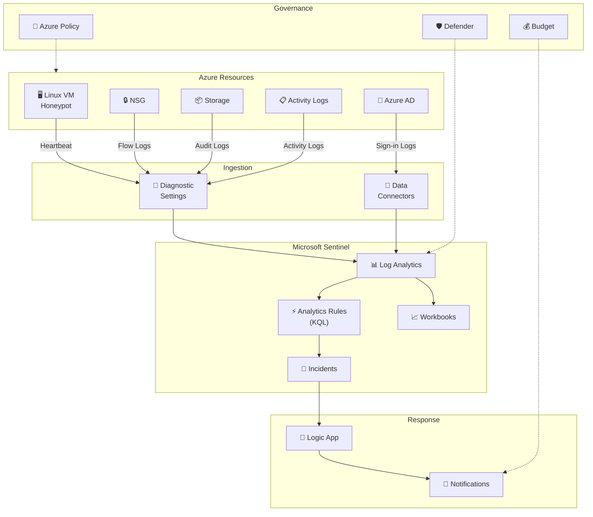

<div align="center">

# 🛡️ Azure Sentinel SecOps Lab

**A production-structured Azure security monitoring lab with Microsoft Sentinel, KQL detections,
automated incident response, and MITRE ATT&CK-mapped analytics — built for cloud security portfolio demonstration.**

[](https://github.com/<your-username>/azure-sentinel-secops/actions/workflows/terraform-ci.yml)


</div>

---

## 📐 Architecture



> Full annotated diagram with data-type labels → [`diagrams/architecture.md`](diagrams/architecture.md)

---

## 🚀 Quick Start

```bash
# 1. Clone
git clone https://github.com/lenoshz/azure-sentinel-secops.git
cd azure-sentinel-secops/terraform

# 2. Configure
cp terraform.tfvars.example terraform.tfvars
# Edit terraform.tfvars with your values

# 3. Login
az login && az account set --subscription "<YOUR_SUB_ID>"

# 4. Deploy
terraform init && terraform plan -out=lab.tfplan && terraform apply lab.tfplan

# 5. Verify
# Open Azure Portal → Microsoft Sentinel → select your workspace
```

> 📖 Detailed walkthrough → [`docs/setup-steps.md`](docs/setup-steps.md)

---

## 🧰 Tech Stack

| Layer | Technology | Purpose |
|-------|-----------|---------|
| **IaC** | Terraform (AzureRM ~> 3.80) | Infrastructure provisioning |
| **SIEM** | Microsoft Sentinel | Detection, investigation, response |
| **Monitoring** | Log Analytics Workspace | Central log repository |
| **Detection** | KQL Analytics Rules | Threat detection queries |
| **Response** | Logic Apps (Playbooks) | Automated incident handling |
| **Governance** | Azure Policy | Compliance guardrails |
| **Security** | Defender for Cloud (Free) | Posture management & recommendations |
| **Secrets** | Azure Key Vault (RBAC) | Credential storage |
| **CI/CD** | GitHub Actions | Terraform lint, validate, security scan |
| **Scanning** | tfsec + Checkov | IaC security analysis |

---

## 🔍 MITRE ATT&CK Coverage

| Detection | KQL File | Tactic | Technique | ID | Severity |
|-----------|----------|--------|-----------|-----|----------|
| Failed Sign-In Burst | [`failed_signin_burst.kql`](kql/failed_signin_burst.kql) | Credential Access | Brute Force | T1110 | Medium |
| Role Assignment Created | [`role_assignment_created.kql`](kql/role_assignment_created.kql) | Privilege Escalation | Account Manipulation | T1098 | High |
| NSG Deny Spike | [`nsg_deny_spike.kql`](kql/nsg_deny_spike.kql) | Discovery | Network Service Discovery | T1046 | Low–Med |

> Threshold rationale and tuning guidance → [`MITRE.md`](MITRE.md)

---

## 📂 Repository Structure

```
azure-sentinel-secops/
├── terraform/                        # Infrastructure as Code
│   ├── providers.tf                  # AzureRM + AzAPI provider config
│   ├── main.tf                       # Core resources (18+ resources)
│   ├── variables.tf                  # Input variables with validation
│   ├── outputs.tf                    # Deployment output values
│   ├── keyvault.tf                   # Key Vault + RBAC + secrets
│   ├── defender.tf                   # Defender for Cloud config
│   └── terraform.tfvars.example      # Sample variable values
├── kql/                              # Sentinel Analytics Queries
│   ├── failed_signin_burst.kql       # Brute-force detection
│   ├── role_assignment_created.kql   # Privilege escalation detection
│   └── nsg_deny_spike.kql           # Network reconnaissance detection
├── playbooks/                        # SOAR Automation
│   └── auto-tag-incident.json        # Logic App ARM template
├── policy/                           # Governance
│   └── assignments.md                # Azure Policy assignment guide
├── workbook/                         # Visualization
│   └── sentinel-workbook-guide.md    # Custom workbook creation guide
├── diagrams/                         # Architecture
│   └── architecture.md               # Mermaid data-flow diagram
├── docs/                             # Documentation
│   ├── architecture.md               # Component & design decisions
│   ├── setup-steps.md                # Step-by-step deployment guide
│   ├── test-scenarios.md             # 3 validation test scenarios
│   ├── screenshots.md                # Portfolio evidence checklist
│   ├── aks-integration.md            # Optional AKS extension
│   └── cost-management.md            # Cost estimates & controls
├── .github/workflows/
│   └── terraform-ci.yml              # CI pipeline (fmt/validate/scan)
├── MITRE.md                          # ATT&CK mapping & thresholds
├── .gitignore                        # Git exclusions
├── LICENSE                           # MIT License
└── README.md                         # This file
```

---

## 📚 Documentation

| Document | Description |
|----------|-------------|
| [Architecture](docs/architecture.md) | Component inventory, design decisions, security controls |
| [Setup Guide](docs/setup-steps.md) | Step-by-step deployment (20–30 min) |
| [Test Scenarios](docs/test-scenarios.md) | 3 validation scenarios with exact commands |
| [Cost Management](docs/cost-management.md) | Cost estimates, budgets, auto-shutdown |
| [Screenshots Guide](docs/screenshots.md) | What to capture for portfolio evidence |
| [AKS Integration](docs/aks-integration.md) | Optional container security extension |
| [Policy Assignments](policy/assignments.md) | Azure Policy configuration & compliance |
| [Workbook Guide](workbook/sentinel-workbook-guide.md) | Custom Sentinel dashboard creation |
| [MITRE Mapping](MITRE.md) | ATT&CK coverage & threshold rationale |

---

## ✅ Evidence Checklist

Track your portfolio evidence:

- [ ] Terraform `plan` and `apply` succeed without errors
- [ ] Microsoft Sentinel shows connected data sources
- [ ] All 3 analytics rules created and enabled
- [ ] Failed sign-in burst test triggers incident
- [ ] Role assignment test triggers high-severity incident
- [ ] NSG deny spike test triggers incident
- [ ] Logic App auto-tags incidents and sends email
- [ ] Azure Policy denies non-compliant resource creation
- [ ] Defender for Cloud Secure Score visible
- [ ] Workbook dashboard shows populated visualizations
- [ ] Cost stays under budget threshold
- [ ] CI pipeline passes on push/PR (format + validate + scan)
- [ ] Screenshots captured per [screenshots guide](docs/screenshots.md)
- [ ] `terraform destroy` completes cleanly

---

## 💰 Cost Estimate

| Scenario | Monthly Estimate |
|----------|-----------------|
| Minimal (VM auto-shutdown, <1 GB logs) | ~$10–15 |
| Active testing (8h/day, 2–5 GB logs) | ~$20–35 |
| Left running (24/7, flow logs on) | ~$40–60 |

> Detailed breakdown → [`docs/cost-management.md`](docs/cost-management.md)

**Cost controls built in:**
- 🔄 VM auto-shutdown at 19:00 UTC daily
- 💸 Budget alerts at 80% (actual) and 100% (forecasted)
- 🆓 Defender for Cloud Free tier
- 📊 PerGB2018 pay-as-you-go Log Analytics pricing

---

## 🔐 Security Controls

| Control | Implementation |
|---------|---------------|
| Network segmentation | VNet + Subnet + NSG (default deny all) |
| Least-privilege SSH | NSG allowlists specific CIDRs only |
| Secrets management | Key Vault with RBAC + purge protection |
| Encryption in transit | Storage requires TLS 1.2 minimum |
| No public data exposure | Storage public blob access disabled |
| Identity hardening | SSH key auth only, password auth disabled |
| Governance | Azure Policy (location + public access deny) |
| Monitoring | Diagnostic settings → Log Analytics → Sentinel |
| Detection | 3 KQL rules with MITRE ATT&CK mapping |
| Response | Logic App auto-tagging + email notification |

---

## 📄 License

This project is licensed under the [MIT License](LICENSE).

---

## 🎯 Built For

This project was designed as a **cloud security portfolio project** for internship applications. It demonstrates hands-on proficiency with:

- **Microsoft Sentinel** (SIEM/SOAR) — detection engineering and incident response
- **Terraform** (IaC) — production-structured infrastructure provisioning
- **KQL** — threat hunting and analytics rule authoring
- **MITRE ATT&CK** — framework-aligned detection coverage
- **Azure Security** — Defender for Cloud, Key Vault, NSG, Policy
- **CI/CD** — automated security scanning with tfsec and Checkov
- **Incident Response** — automated playbook with Logic Apps

> *"Security is not a product, but a process."* — Bruce Schneier
