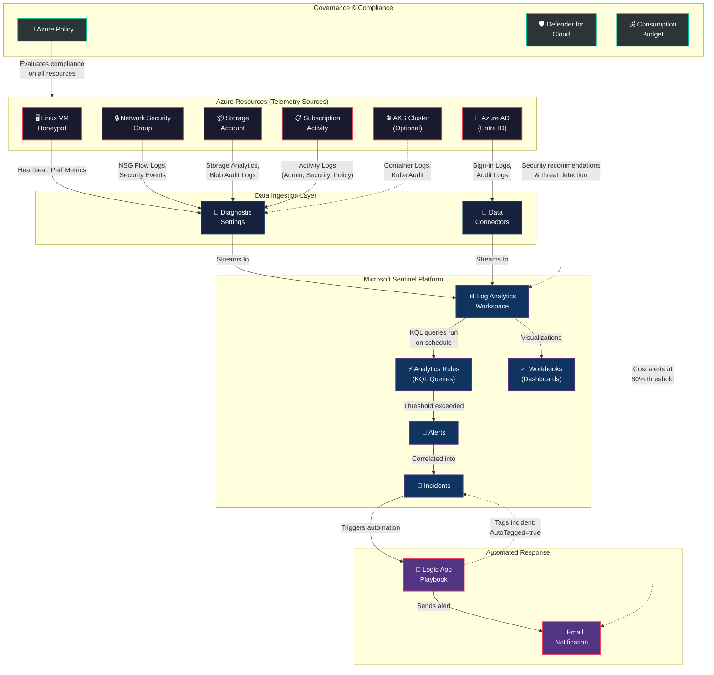

# Architecture Diagram

The diagram below shows the end-to-end data flow from Azure resource telemetry through Microsoft Sentinel's detection and response pipeline.

## Data Flow Summary

| Step | Source | Destination | Data Type |
|------|--------|-------------|-----------|
| 1 | Linux VM | Diagnostic Settings | Heartbeat, Performance Metrics |
| 2 | NSG | Diagnostic Settings | Flow Logs, Security Events |
| 3 | Storage Account | Diagnostic Settings | Blob Audit Logs |
| 4 | Subscription | Diagnostic Settings | Activity Logs (Admin, Security, Policy) |
| 5 | Azure AD (Entra ID) | Sentinel Data Connector | Sign-in Logs, Audit Logs |
| 6 | Diagnostic Settings | Log Analytics Workspace | All telemetry streams |
| 7 | Log Analytics | Analytics Rules | Scheduled KQL queries |
| 8 | Analytics Rules | Alerts → Incidents | Threshold-based detections |
| 9 | Incidents | Logic App Playbook | Automated tagging + email |
| 10 | Azure Policy | All Resources | Compliance evaluation |
| 11 | Defender for Cloud | Log Analytics | Security recommendations |
