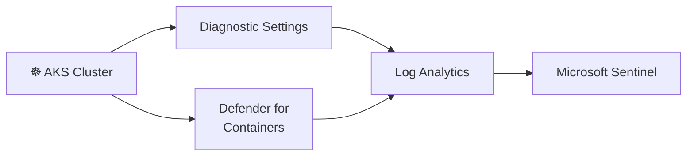

# AKS Integration Guide (Optional Extension)

This guide covers how to extend the Sentinel SecOps Lab with an Azure Kubernetes Service (AKS) cluster for container security monitoring.

> ⚠️ **Cost Warning:** AKS adds significant cost. Even a minimal cluster (1 node, Standard_B2s) costs ~$30/month. Only deploy this if you have budget headroom and want to showcase container security skills.

---

## Architecture Extension



**New data sources added:**
- `ContainerLog` / `ContainerLogV2` — stdout/stderr from pods
- `KubeEvents` — Kubernetes API server events
- `KubeAuditLogs` — API server audit trail (create, delete, exec)
- `InsightsMetrics` — Container CPU, memory, network

---

## Terraform Resources

Add the following to a new file `terraform/aks.tf`:

```hcl
# =============================================================================
# aks.tf — Optional AKS cluster for container security monitoring
# =============================================================================

resource "azurerm_kubernetes_cluster" "lab" {
  name                = "${var.prefix}-aks"
  location            = azurerm_resource_group.main.location
  resource_group_name = azurerm_resource_group.main.name
  dns_prefix          = "${var.prefix}-aks"
  tags                = var.tags

  default_node_pool {
    name       = "default"
    node_count = 1
    vm_size    = "Standard_B2s"
    os_sku     = "Ubuntu"
  }

  identity {
    type = "SystemAssigned"
  }

  oms_agent {
    log_analytics_workspace_id = azurerm_log_analytics_workspace.sentinel.id
  }

  network_profile {
    network_plugin = "kubenet"
  }
}

# Diagnostic settings for AKS
resource "azurerm_monitor_diagnostic_setting" "aks_diagnostics" {
  name                       = "${var.prefix}-diag-aks"
  target_resource_id         = azurerm_kubernetes_cluster.lab.id
  log_analytics_workspace_id = azurerm_log_analytics_workspace.sentinel.id

  enabled_log {
    category = "kube-apiserver"
  }

  enabled_log {
    category = "kube-audit"
  }

  enabled_log {
    category = "kube-audit-admin"
  }

  enabled_log {
    category = "guard"
  }

  metric {
    category = "AllMetrics"
    enabled  = true
  }
}
```

---

## KQL Detection: Suspicious `kubectl exec` into Pod

```kql
// Detect kubectl exec commands — potential container escape or lateral movement
// MITRE: Execution (TA0002) → T1609 — Container Administration Command
AzureDiagnostics
| where Category == "kube-audit"
| where TimeGenerated > ago(1h)
| extend RequestObject = parse_json(log_s)
| where RequestObject.verb == "create"
| where RequestObject.objectRef.subresource == "exec"
| project
    TimeGenerated,
    User        = tostring(RequestObject.user.username),
    Namespace   = tostring(RequestObject.objectRef.namespace),
    PodName     = tostring(RequestObject.objectRef.name),
    SourceIP    = tostring(RequestObject.sourceIPs[0]),
    UserAgent   = tostring(RequestObject.userAgent)
| order by TimeGenerated desc
```

---

## KQL Detection: Privileged Container Deployed

```kql
// Detect creation of privileged containers — escalation risk
// MITRE: Privilege Escalation (TA0004) → T1611 — Escape to Host
KubeEvents
| where TimeGenerated > ago(24h)
| where Name has "privileged"
   or Message has "privileged"
| project TimeGenerated, Name, Namespace, Message, Computer
| order by TimeGenerated desc
```

---

## Deployment Steps

1. **Add the AKS Terraform code** to `terraform/aks.tf`
2. **Deploy:**
   ```bash
   terraform plan -target=azurerm_kubernetes_cluster.lab
   terraform apply -target=azurerm_kubernetes_cluster.lab
   ```
3. **Get credentials:**
   ```bash
   az aks get-credentials \
     --resource-group rg-sentinel-secops-lab \
     --name secops-aks
   ```
4. **Deploy a test workload:**
   ```bash
   kubectl run nginx --image=nginx:latest --port=80
   kubectl exec -it nginx -- /bin/bash  # This should trigger the detection
   ```
5. **Verify logs in Sentinel:**
   ```kql
   ContainerLog
   | where TimeGenerated > ago(15m)
   | take 10
   ```

---

## Cost Impact

| Resource | Additional Monthly Cost |
|----------|----------------------|
| AKS (1x Standard_B2s node) | ~$30.37 |
| Log Analytics (container logs, ~2 GB/month) | ~$10.44 |
| **Total AKS addition** | **~$40/month** |

Consider deploying AKS only during testing, then destroying it:

```bash
terraform destroy -target=azurerm_kubernetes_cluster.lab
```
