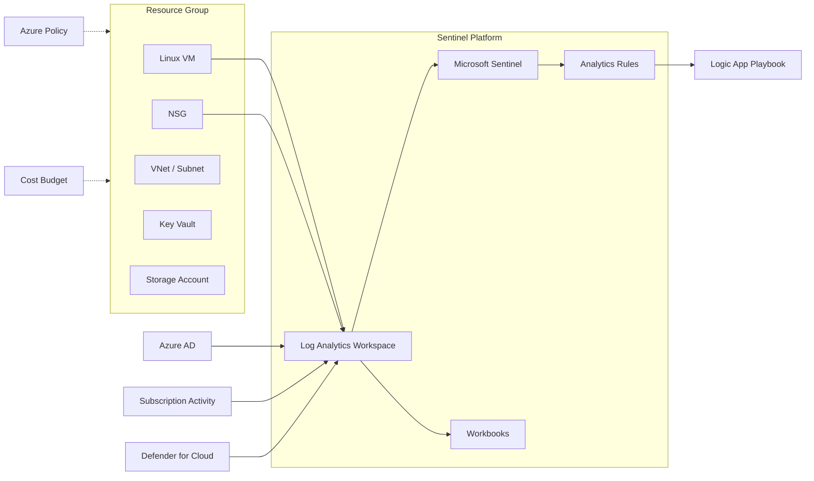

# Architecture Overview

This document describes the architecture of the Azure Sentinel SecOps Lab including the purpose of each component, how data flows between them, and design decisions made for a cost-effective learning environment.

---

## High-Level Architecture

> For the full annotated diagram with data-type labels, see [`diagrams/architecture.md`](../diagrams/architecture.md).

---

## Component Inventory

| Component | Azure Resource | Purpose | SKU / Tier |
|-----------|---------------|---------|------------|
| Resource Group | `azurerm_resource_group` | Logical container for all lab resources | — |
| Log Analytics | `azurerm_log_analytics_workspace` | Central log repository; Sentinel's backing store | PerGB2018, 30-day retention |
| Microsoft Sentinel | `azurerm_sentinel_log_analytics_workspace_onboarding` | SIEM/SOAR platform for detection & response | Consumption-based |
| Virtual Network | `azurerm_virtual_network` + `azurerm_subnet` | Isolated network for lab workloads | 10.0.0.0/16 |
| Network Security Group | `azurerm_network_security_group` | Layer-4 firewall; SSH allowlist + default deny | — |
| Linux VM | `azurerm_linux_virtual_machine` | Honeypot / telemetry source; Ubuntu 22.04 | Standard_B1s |
| Key Vault | `azurerm_key_vault` | Secrets management for VM admin credentials | Standard, RBAC-enabled |
| Storage Account | `azurerm_storage_account` | Secure blob storage (TLS 1.2, no public access) | Standard_LRS |
| Defender for Cloud | `azurerm_security_center_*` | Security posture management, recommendations | Free tier |
| Logic App | ARM template (JSON) | Automated incident response (tagging + email) | Consumption plan |
| Azure Policy | Manual assignments | Governance guardrails (location + storage) | Built-in policies |
| Budget | `azurerm_consumption_budget_resource_group` | Cost alerting at 80% / 100% thresholds | — |

---

## Design Decisions

### 1. Why PerGB2018 for Log Analytics?

The PerGB2018 (pay-per-GB) pricing model is the default for new workspaces and is ideal for lab environments with unpredictable ingestion volumes. Commitment tiers (100 GB/day+) only make sense at production scale.

### 2. Why Standard_B1s for the VM?

The B1s burstable VM is the smallest general-purpose size eligible for the Azure Free Account credit. At ~$7.59/month it minimizes cost while still generating meaningful telemetry (heartbeat, performance counters, login events).

### 3. Why Key Vault with RBAC instead of Access Policies?

RBAC authorization provides finer-grained access control and aligns with Azure's recommended approach. It also makes it possible to use the same Entra ID roles for Key Vault as for all other resources, simplifying governance.

### 4. Why auto-shutdown at 19:00 UTC?

The `dev_test_global_vm_shutdown_schedule` turns off the VM every evening to prevent runaway compute costs. This alone saves ~50% of the VM's monthly cost for a typical lab user.

### 5. Why Defender for Cloud Free tier?

The Free tier provides Security Secure Score, basic recommendations, and Azure Security Benchmark assessments — enough for a portfolio demonstration. The Standard (P1/P2) tiers add runtime protection but cost ~$15/server/month.

---

## Security Controls Summary

| Control | Implementation |
|---------|---------------|
| Network segmentation | VNet + Subnet + NSG with default deny |
| Least privilege SSH | NSG allowlists specific IP CIDRs only |
| Secrets management | Key Vault with RBAC, purge protection |
| Encryption in transit | Storage Account requires TLS 1.2 minimum |
| No public blob access | `allow_nested_items_to_be_public = false` |
| Identity | SSH key auth only; password auth disabled on VM |
| Monitoring | Diagnostic settings stream to Log Analytics |
| Detection | Sentinel analytics rules with MITRE mapping |
| Response | Logic App auto-tagging and email notification |
| Governance | Azure Policy (location restriction, public access deny) |
| Cost control | Budget alerts + VM auto-shutdown |
